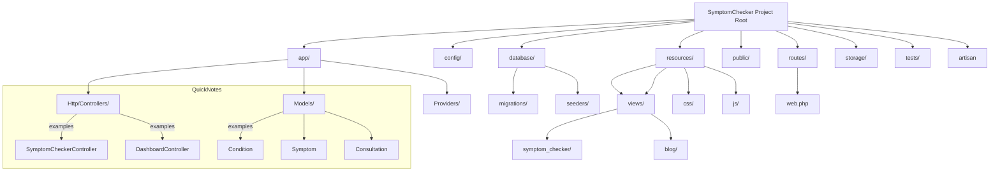

# SymptomChecker — Architecture & Project Structure (Diagrams)

Below are two concise, explanatory diagrams (Mermaid) you can use in your report or slides.

**How to view:** Install a Mermaid preview extension in your editor (e.g., "Markdown Preview Mermaid Support") or paste the diagrams into an online Mermaid live editor (https://mermaid.live).

---

## 1) High-level Architecture (Data Flow)

```mermaid
flowchart TD
  A[User Browser / Mobile] -->|HTTP(S)| B[Web Server / Laravel]
  B --> C[Routing Layer (routes/web.php)]
  C --> D[Controllers]
  D --> E[Business Logic & Services]
  E --> F[Eloquent Models]
  F --> G[(Database: MySQL/Postgres)]
  E --> H[External Resources]
  H -->|Links| I[Authoritative Health Sites (Mayo, CDC, NIH)]

  subgraph "Web Server"
    B
    C
    D
    E
    F
  end

  click G "#database-notes" "Open Database notes"

  classDef infra fill:#f6f8fa,stroke:#333,stroke-width:1px;
  class B,C,D,E,F,G infra

```

**Explanation (short):**
- User interacts with the UI (Blade + Tailwind + Alpine/Vite).
- Requests go to Laravel routes and controllers which execute business logic (symptom matching algorithm).
- Controllers call Eloquent models to read/write data to the relational database (MySQL or PostgreSQL).
- The app links to external trusted resources (Mayo Clinic, CDC, Harvard, NIH) for articles.

---

## 2) Project Structure (Concise, developer-focused)



**Explanation (short):**
- `app/` contains controllers (request handling) and models (Eloquent ORM mapping).
- `resources/views/` holds Blade templates (UI). `resources/css` and `resources/js` hold assets compiled by Vite.
- `database/migrations` define schema; `database/seeders` populate initial symptoms/conditions.
- `routes/web.php` defines public endpoints (home, symptom-checker, blog, dashboard).

---

## 3) Quick Reference: Key Files & Purpose

- `app/Http/Controllers/SymptomCheckerController.php` — core symptom-wizard flows & algorithm.
- `app/Models/Symptom.php`, `Condition.php`, `Consultation.php` — domain models and relationships.
- `database/migrations/*` — schema (users, symptoms, conditions, consultations, pivots).
- `database/seeders/SymptomSeeder.php` — seed initial symptom list.
- `resources/views/symptom_checker/*.blade.php` — wizard, results, treatment views.
- `routes/web.php` — registers all HTTP routes.
- `.env` — runtime configuration (DB credentials, app URL).

---

## 4) Small Database Notes {#database-notes}

- Primary DB options: `mysql` (common) or `pgsql` (PostgreSQL). Laravel config supports both.
- Key tables: `symptoms`, `conditions`, `condition_symptom`, `consultations`, `consultation_symptom`, `consultation_condition`, `health_vitals`, `treatments`, `medications`.
- Data flow: user selection → consultation insert → pivot inserts (selected symptoms) → condition matching & consultation_condition inserts.

---

If you want, I can:
- Export these Mermaid diagrams to PNG/SVG for your slides, or
- Add a single-page printable PDF with both diagrams and the short explanations.

Which would you like next?